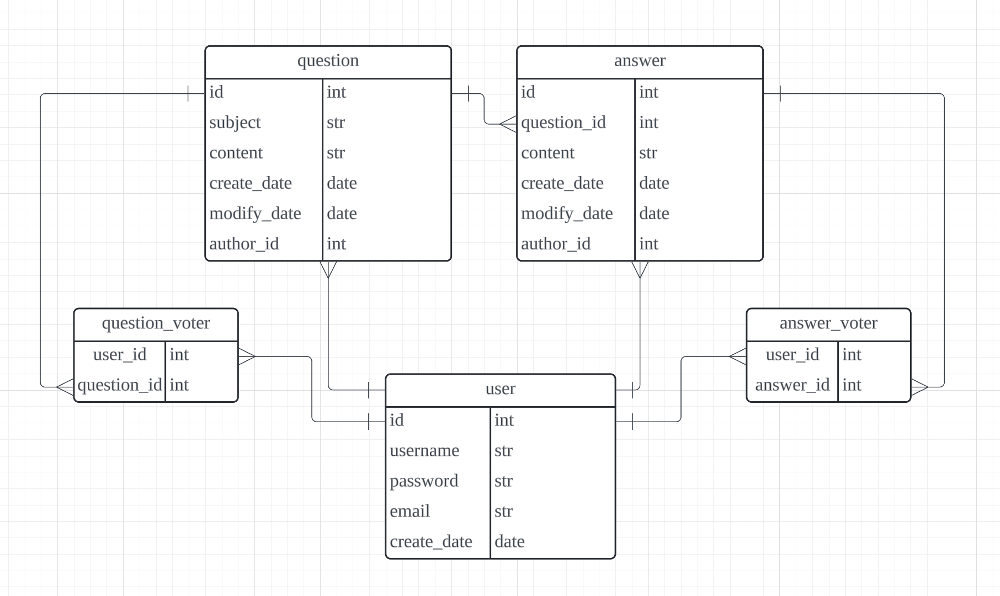
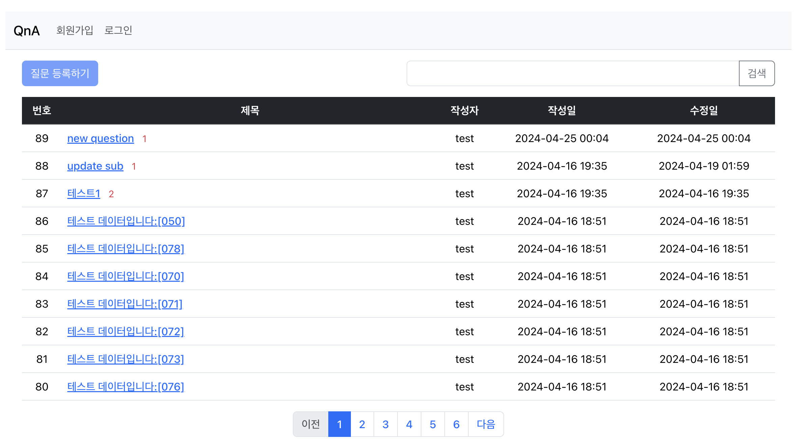
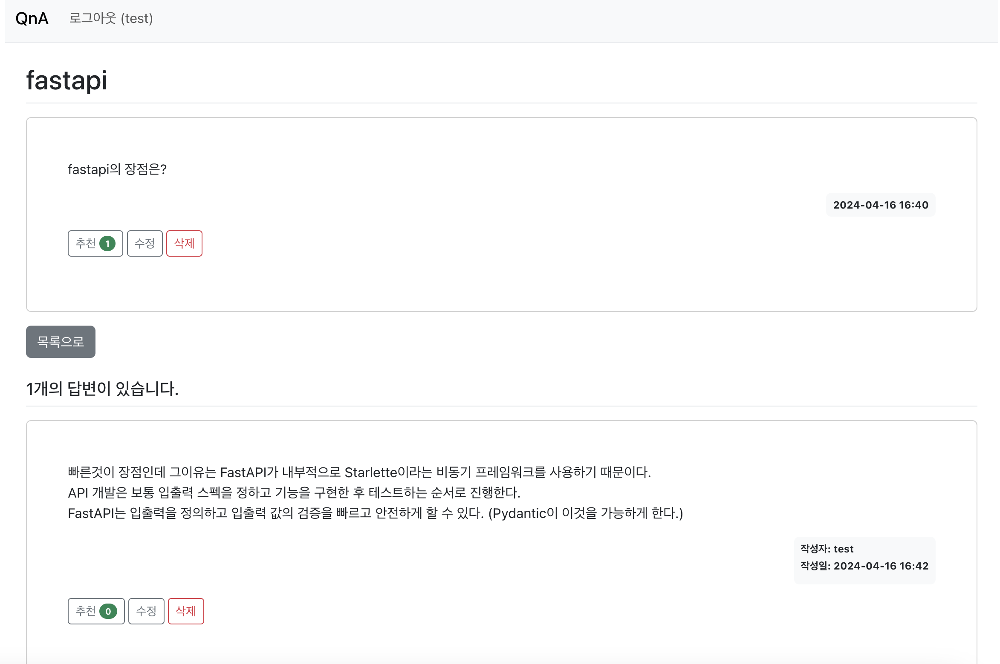
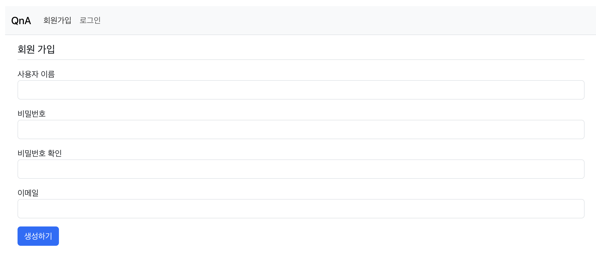
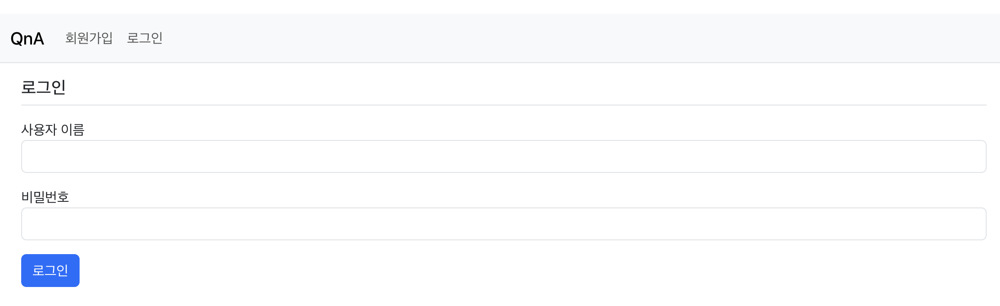
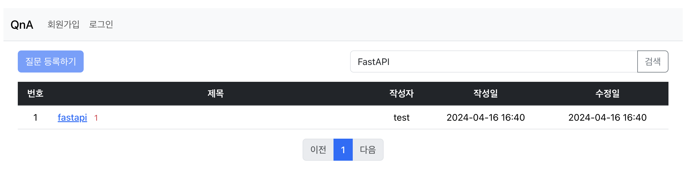

## FastAPI와 Svelte를 이용한 QnA Board

<br>


<br>

## 1. 프로젝트 목표
---

FastAPI 동작 방식에 대한 이해
- fastapi는 ASGI인터페이스가 구현된 starlette를 추상화하여 구현한 프레임워크이다.
- pydantic을 통해 request, response 데이터를 검증하고 관리한다.

Svelte 동작 방식에 대한 이해
- 가상Dom을 사용하지 않고 실제 Dom을 사용한다.
- Svelte는 앱을 실행 시점(Run time)에서 해석하지 않고 빌드 시점(Build time)에서 Vanilla JavaScript Bundle로 컴파일하여 속도가 빠르고 따로 라이브러리를 배포할 필요가 없어 간편하다.


## 2. 구현 기능
---


### 2-1. Model

- ERD



<br>

### 2-2. API

<br>

|API명|URL|메소드|설명|
|----|----|----|----|
|회원가입|/user/cerate|POST|회원을 등록한다|

- Request

    SignUpRequest
    ```python
    class SignUpRequest(BaseModel):
        username: str
        password1: str
        password2: str
        email: EmailStr
    ```


- Response

    UserSchema
    ```python
    class UserSchema(BaseModel):
        id: int
        username: str
        email: EmailStr
    ```


|API명|URL|메소드|설명|
|----|----|----|----|
|로그인|/user/login|POST|로그인을 한다|

- Request

    LogInRequest
    ```python
    class LogInRequest(BaseModel):
        username: str
        password: str
    ```

- Response

    TokenSchema
    ```python
    class TokenSchema(BaseModel):
        access_token: str
        token_type: str
        username: str
    ```

|API명|URL|메소드|설명|
|----|----|----|----|
|질문 리스트 조회|/question/list|GET|질문 목록을 10개씩 페이징하여 조회한다|

- Request

    없음

    - 파라미터
        
        |이름|타입|설명|
        |---|---|---|
        |page|int|조회할 페이지 넘버|
        |size|int|페이징할 목록 갯수|
        |keyword|str|검색할 키워드|


- Response

    QuestionListSchema
    ```python
    class QuestionListSchema(BaseModel):
        total: int
        question_list: List[QuestionSchema]
    ```

|API명|URL|메소드|설명|
|----|----|----|----|
|질문 상세 조회|/question/{question_id}|GET|질문 상세 내역을 조회한다|

- Request

    없음


- Response

    QuestionSchema
    ```python
    class QuestionSchema(BaseModel):
        id: int
        subject: str
        content: str
        author_id: int
        create_date: datetime.datetime
        modify_date: datetime.datetime | None
        answers: List[AnswerSchema]
        user: UserSchema | None
        voter: List[UserSchema]
    ```

|API명|URL|메소드|설명|
|----|----|----|----|
|질문 등록|/question/cteate|POST|질문을 작성한다|

- Request

    CreateQuestionRequest
    ```python
    class CreateQuestionRequest(BaseModel):
        subject: str
        content: str
    ```


- Response

    QuestionSchema


|API명|URL|메소드|설명|
|----|----|----|----|
|질문 수정|/question/{question_id}|PATCH|질문을 수정한다|

- Request

    CreateQuestionRequest


- Response

    QuestionSchema

|API명|URL|메소드|설명|
|----|----|----|----|
|질문 삭제|/question/{question_id}|DELETE|질문을 삭제한다|

- Request

    없음


- Response

    없음


|API명|URL|메소드|설명|
|----|----|----|----|
|답변 조회|/answer/{answer_id}|GET|답변 조회|

- Request

    없음


- Response

    AnswerSchema
    ```python
    class AnswerSchema(BaseModel):
        id: int
        question_id: int
        content: str
        author_id: int
        create_date: datetime.datetime
        modify_date: datetime.datetime | None
        user: UserSchema | None
        voter: List[UserSchema]
    ```

|API명|URL|메소드|설명|
|----|----|----|----|
|답변 등록|/answer/cteate|POST|답변을 작성한다|

- Request

    CreateAnswerRequest
    ```python
    class CreateAnswerRequest(BaseModel):
        content: str
    ```

- Response

    AnswerSchema


|API명|URL|메소드|설명|
|----|----|----|----|
|답변 수정|/answer/{answer_id}|PATCH|답변을 수정한다|

- Request

    CreateAnswerRequest


- Response

    AnswerSchema

|API명|URL|메소드|설명|
|----|----|----|----|
|답변 삭제|/answer/{answer_id}|DELETE|답변을 삭제한다|

- Request

    없음


- Response

    없음


|API명|URL|메소드|설명|
|----|----|----|----|
|질문 추천|/question/vote|POST|질문을 추천한다|

- Request

    QuestionVoteRequest
    ```python
    class QuestionVoteRequest(BaseModel):
        question_id: int
    ```


- Response

    없음


|API명|URL|메소드|설명|
|----|----|----|----|
|답변 추천|/answer/vote|POST|답변을 추천한다|

- Request

    AnswerVoteRequest
    ```python
    class AnswerVoteRequest(BaseModel):
        answer_id: int
    ```


- Response

    없음

<br>

### 2-2. 기능 상세

<br>

유저 인증
- OAuth2 인증방식을 사용한다.
- FastAPI의 라우팅 함수는 HTTP 헤더에 담긴 액세스 토큰을 통해 사용자명과 토큰의 유효기간을 얻을 수 있다.
- 컨텐츠 작성시에 localstorage에 저장한 jwt토큰을 인증하여 사용한다.

<br>

질문과 답변 추천
- 질문과 답변에 대한 추천을 할 수 있다.
- question, answer 테이블과 user테이블 간에 many-to-many 관계 테이블을 만들어 추천한 유저id와 질문id를 db에 저장한다.

<br>

컨텐츠 검색
- 질문, 답변, 작성자에 키워드가 들어가 있는 것을 검색한다.
```python
search = "%{}%".format(keyword)
sub_query = self.session.query(Answer.question_id, Answer.content, User.username)\
    .outerjoin(User, and_(Answer.author_id == User.id)).subquery()
_question_list = _question_list \
    .outerjoin(User) \
    .outerjoin(sub_query, and_(sub_query.c.question_id == Question.id)) \
    .filter(Question.subject.ilike(search) |
            Question.content.ilike(search) |
            User.username.ilike(search) |
            sub_query.c.content.ilike(search) |
            sub_query.c.username.ilike(search)
            )
```

- Question모델의 질문 제목, 질문 내용은 조인 없이 검색 조건으로 사용
- 질문 작성자는 User 모델과 아우터조인하여 검색 조건으로 사용
- 답변 내용과 답변 작성자를 검색하도록 서브쿼리를 작성한 후 Question 모델과 아우터조인 하여 구현하였다.


## 3. Front
---

1. 홈


2. 질문 상세


3. 회원가입


4. 로그인


5. 검색


